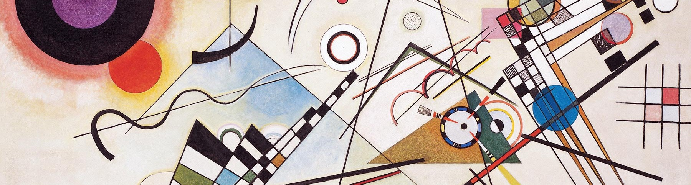

### My North Star
I believe a human's capacity is much greater than what we think. And we must possess the will to utilize that capacity of knowledge and energy, prioritizing a greater future for all over personal comfort and success. It is this will that makes everything possible.
